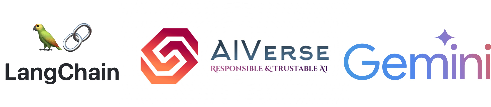

# Build a RAG with Google Gemini and Langchain

You might wonder why we can’t just feed the entire domain knowledge as context to the LLM. While this idea is valid, the reality is that LLMs have limitations on the amount of context they can handle. For example, Google Gemini, despite its advanced capabilities, can process up to 1 million tokens — an impressive capacity but still finite. Processing large amounts of context requires significant computational power and cost, which is impractical for many applications.

This is where RAG remains highly relevant. By splitting the domain text into manageable chunks and retrieving only the most pertinent information for a given query, RAG provides a cost-effective and efficient way to leverage domain-specific knowledge. The notebook explores how to build a RAG system using Google Gemini and Langchain.

* First, we have to split our domain text into a small set of chunks.
* Convert each chunk into embeddings using an embedding model here in our case “Google Gemini”
* Store them into a vector database
* Query vector database and get respective documents for a given question using semantic search.
* Pass those documents as a context to LLM along with questions and get an answer.

Note: We need to generate API keys from [here]([https://aistudio.google.com/app/apikey?_gl=1*1q8yq5a*_ga*MTQ5MDE1MTI5MS4xNzE3MjUyMDI1*_ga_P1DBVKWT6V*MTcxNzc1NjIwOS4zLjAuMTcxNzc1NjIxMS41OC4wLjQ2NDE0NzY1Mw..](https://ai.google.dev/gemini-api/docs?_gl=1*kc0j5d*_ga*ODExMzA0ODAzLjE3MzY2OTk2Njc.*_ga_P1DBVKWT6V*MTczNjY5OTY2Ny4xLjAuMTczNjY5OTY2Ny4wLjAuMTgwNTcyNzgxNg..)) and export them as GOOGLE_API_KEY
