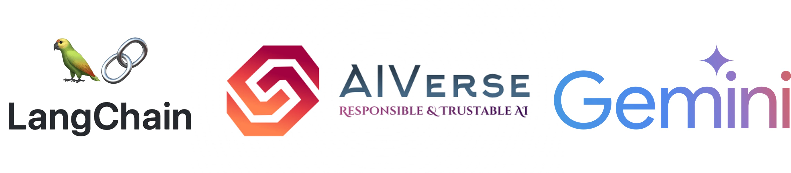
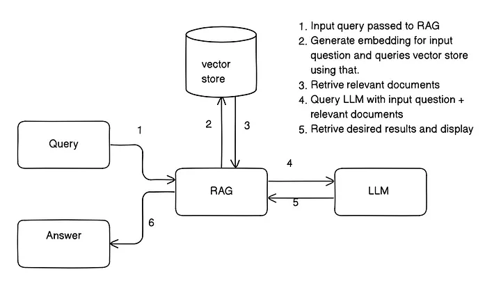

# Build a RAG with Google Gemini and Langchain

[](https://colab.research.google.com/github/sander-ali/RAG-with-Gemini-and-Langchain/blob/main/RAG_with_Gemini_and_Langchain.ipynb)

A practical implementation of Retrieval Augmented Generation (RAG) using Google's Gemini LLM and LangChain framework.



You might wonder why we can't feed the entire domain knowledge as context to the LLM. While this idea is valid, the reality is that LLMs have limitations on how much context they can handle. For example, despite its advanced capabilities, Google Gemini can process up to 1 million tokens that is impressive capacity but still finite. Processing large amounts of context requires significant computational power and cost, which is impractical for many applications.

This is where RAG truly shines. By breaking down the domain text into manageable chunks and retrieving only the most relevant information for a given query, RAG offers a cost-effective and efficient way to harness domain-specific knowledge. The notebook delves into the process of building RAG system using Google Gemini and Langchain.




* First, we have to split our domain text into small chunks.
* Convert each chunk into embeddings using an embedding model, in our case, "Google Gemini."
* Store them in a vector database
* Query vector database and get respective documents for a given question using semantic search.
* Pass those documents as a context to LLM along with questions and get an answer.


## Features

- Text generation with Gemini Pro
- Image analysis with Gemini Pro Vision
- Document Q&A with RAG
- PDF processing and chunking
- Vector similarity search
- Custom prompt templates

## Installation

- Install system dependencies for PDF processing capabilities using the following commands.
```bash
sudo apt -y -qq install tesseract-ocr libtesseract-dev
```
```bash
sudo apt-get -y -qq install poppler-utils libxml2-dev libxslt1-dev antiword unrtf poppler-utils pstotext tesseract-ocr flac ffmpeg lame libmad0 libsox-fmt-mp3 sox libjpeg-dev swig
```

- Create a virtual environment using conda and install the required packages using the following commands.

```bash
conda create -n rag-gemini python=3.10 -y
```
```bash
conda activate rag-gemini
```
```bash
pip install -r requirements.txt
```


We’ve provided a [Jupyter Notebook](RAG_with_Gemini_and_Langchain.ipynb) demonstrating how to:
<!-- - Install dependencies `pip install -r requirements.txt` -->
- Configure and invoke Google Gemini for text and image processing [here]([https://aistudio.google.com/app/apikey?_gl=1*1q8yq5a*_ga*MTQ5MDE1MTI5MS4xNzE3MjUyMDI1*_ga_P1DBVKWT6V*MTcxNzc1NjIwOS4zLjAuMTcxNzc1NjIxMS41OC4wLjQ2NDE0NzY1Mw..](https://ai.google.dev/gemini-api/docs?_gl=1*kc0j5d*_ga*ODExMzA0ODAzLjE3MzY2OTk2Njc.*_ga_P1DBVKWT6V*MTczNjY5OTY2Ny4xLjAuMTczNjY5OTY2Ny4wLjAuMTgwNTcyNzgxNg..)) and export them as `GOOGLE_API_KEY`
- Implement a RetrievalQA pipeline for large PDF documents using LangChain

<!-- Note: We need to generate API keys from [here]([https://aistudio.google.com/app/apikey?_gl=1*1q8yq5a*_ga*MTQ5MDE1MTI5MS4xNzE3MjUyMDI1*_ga_P1DBVKWT6V*MTcxNzc1NjIwOS4zLjAuMTcxNzc1NjIxMS41OC4wLjQ2NDE0NzY1Mw..](https://ai.google.dev/gemini-api/docs?_gl=1*kc0j5d*_ga*ODExMzA0ODAzLjE3MzY2OTk2Njc.*_ga_P1DBVKWT6V*MTczNjY5OTY2Ny4xLjAuMTczNjY5OTY2Ny4wLjAuMTgwNTcyNzgxNg..)) and export them as GOOGLE_API_KEY -->


## Prerequisites
Note: This code tested on Linux OS.
- Python 3.10+
- Google Gemini API key
- 8GB+ RAM recommended
- Basic understanding of LLMs and embeddings


## Contributing
Pull requests are welcome! For major changes, please open an issue first.